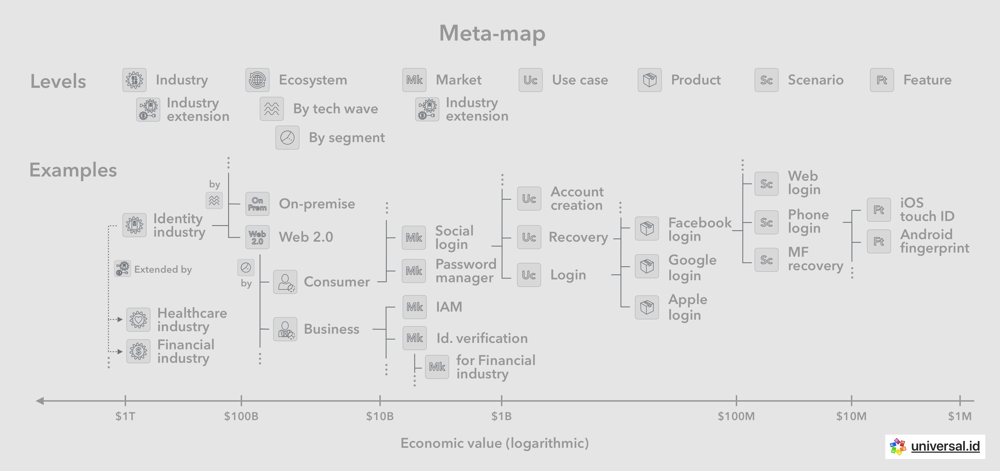
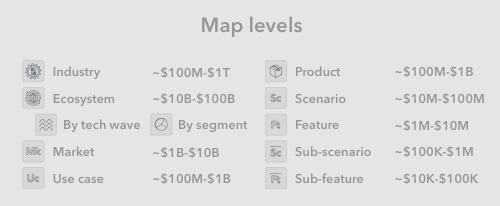
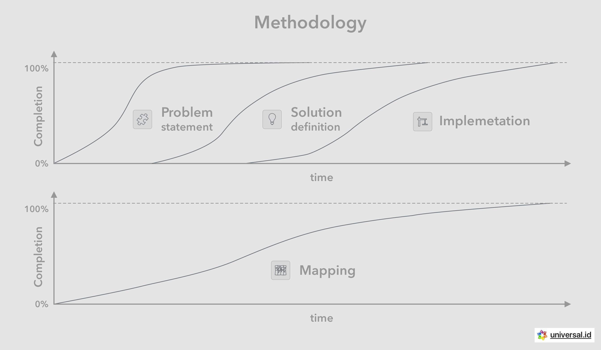
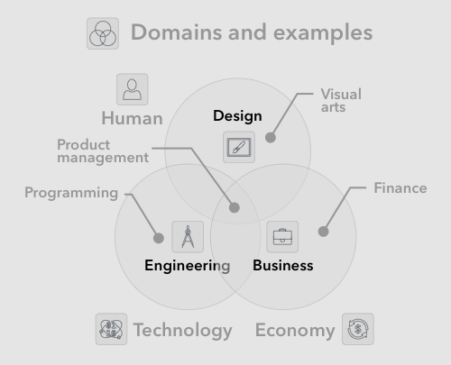

# 🧐 Meta

The topic contains the collection of meta information needed to make sense of the map's structure, its individual parts, and high level concepts.

## 🗺 Meta-map

The comprehensive map we are putting together should encompass all levels of activity in the industry, starting from the very top level (industry itself), continuing down to the various ecosystems, underlying markets and use-cases, and drilling down to the specific products, scenarios and features. At all of these levels we will be able to apply the lenses, tools and perspectives described above, in order to build an even more comprehensive understanding. See other sections for definitions of meta-subjects such as lenses, tools, perspectives and domains.

### 🎚 Levels

There is a certain hierarchy to the industry map with multiple levels, each corresponding to different economic activity value orders of magnitude. The exact dollar calculation for each level activity is not precise or even feasible to obtain in some cases. Nonetheless we have included approximate values for illustrative purposes only, meaning these exact figures should not be taken too seriously.

Below are the levels used in the map, followed by their estimated economic order of magnitude:

* **Industry** - $100B-$1T
* **Ecosystem** -by technology wave and/or segment - $10B-$100B
* **Market** - by solution or product category- $1B-$10B
* **Use case** - $100M–$1B - may be served by multiple competing products
* **Product** - $100M-$1B - may be satisfying multiple use cases
* **Scenario** - $10M-$100M
* **Feature** - $1M - $10M
* **Sub-scenario** - $100K- $1M
* **Sub-feature** - $10K- $100K

### ⚙️ Industry

The industry scope represent the space of all economic activities related to a specific subject, as well as all the businesses and offerings that add value in that general area. Most often this is related set of human needs such as with the entertainment and hospitality industries. At other times it revolves around a specific set of supporting activities for other industries such as with the information technology industry, or its subset the digital identity \[systems] industry. Example of the identity industry pertains to all of the businesses and offerings that focus on adding value to the greater economy through the uptake, usage and support of identity systems.

The greater space may encompass vastly different customers, modes of delivery and technologies, each of which will form a separate sub-ecosystem based on categories such as customer segments or technology waves.

### 🌐 Ecosystem

The ecosystem perspective focuses on the significant relations and economic interactions between the industry players. An effective way of doing this is following the flow of value between different types of players all the way to the end-customers.

These ecosystems can be further divided down into sub-ecosystems, often based on how flow of value converges within certain groups of ecosystem players. The identity space or ecosystem for examples can be divided into the consumer, business and government segments, or separately separated based on the type of technology (digital, physical, etc) and technology wave (on-premise, web 2.0, etc).

#### 〰️ Technology wave

The larger sub-ecosystems of an industry are formed based on specific technology waves that transform that industry by pushing the frontiers of efficiency and significantly affecting the cost and revenue models. For example, the advent of digital packet switching in tandem with Moore’s law transformed the information systems industry, due to the dramatically lower cost of information transmission using digital technology, and lead to emergence of the internet.

#### ☮️ Ecosystem segment

We can pivot economic activity inside an ecosystem based on the final customer they serve, ignoring cross segment activities. Some ecosystems do not have significantly cross segment activity, and so can be cleanly subdivided into sub-ecosystems corresponding to each given market segment. In such cases we can safely deal with segment ecosystems as mostly separate spaces. For example the identity ecosystems for consumer and business are largely independent in terms of economic activity, so we can consider them in isolation.

### 🛍 Market

The market scope represents the space of all activities meant to provide offerings for a specific set of use cases. The markets generally have two sides, one side will be the providers with the offering, and the other side will be the customers, who make the final decision about purchase and usage. The offering described may take the form of one product or in more complex settings it may consist of multiple solutions or products from various providers.

#### ☮️ Segment

Given that customers generally fall within certain categories, based on their needs and conditions, marketing professionals tend to segment the markets based on customer type. The most common segments used in large markets are consumer, business (consisting of small, mid-market, enterprise), and government (sometimes as institution and nonprofits).

#### 🤳 Use case

With every product or solution, most often there are a handful set of use-cases that describe the way users and customers receive value through usage. These are descriptions of user interaction with the product interfaces, including the specific action that yields value per user's cognitive processes. Our recurring activities everyday are rife with examples of use cases, such as using a social media app to consumer or publish content, or using a refrigerator to store and retrieve food items.

Use cases are often what is associated in customers' minds with some type of economic or behavioral (also a form of economic) value, and significantly effects purchasing decisions. The extent of this value and its substitutes in turn determines aspects of the business model such as pricing, profit and cost.

#### ☠️ Harm cases

Aka. attack vectors or vulnerabilities, this describes the set of scenarios that lead to significantly undesirable outcomes. These can occur as the result of a malicious attack, or due to oversight or accidents. Many product security features are first conceived and are justifiable due to the existence of credible attacks or vulnerabilities, that have historically proven to be feasible and costly.

### 📦 Product

Product generally describes a self-containing unit that a provider offers a customer. The customer's involvement is limited to learning about a product, and eventually making purchase decisions (positive or negative) after further learning and interactions. The provider is responsible for defining the scope of a product, the functionality it offers, its brand and positioning relative to other substitutes.

There is a lot that goes into defining, building and supporting a superior product, but it all starts with scoping the product in terms of use-cases, functionality and audience. For example, in the case of smartphones, each iPhone product line is scoped for a specific audience (with specific financial capabilities for example), and iPhone's general use cases are targeted for non-technical consumers who want a device that just works for daily common tasks. Other products, such as say a Samsung Android phone, defines a different scope, namely for more technical users who value productivity and customization use cases as well.

#### 🎬 Scenario

is a common descriptive tool used to communicate specific functionality of a product as well as its temporal relation to users and other actors along a certain class of interactions. Scenarios, at various level of granularity, can be used to breakdown and reassemble the full functionality that a product provides, and so they make the perfect scoping vehicle for the product's internal development.

#### 🎮 Feature

is a self-containing unit of function provided by a product for a specific purpose. These are perceived and accounted for by customers in their mental valuation and decision making process. Specific customers may value a specific feature differently based on their wants and needs. Continuing with our smartphone example, the face recognition feature may be offered on specific lines of products, with the mixed purpose of providing quicker access to the phone for productivity, as well as showcasing the latest technology for tech enthusiasts.

### 🏛 Entity

Entities represent the private goods or public goods organizations that may exist at various levels of the map. Generally we enumerate the following types of entities:

1. **Individual** - Person or household
2. **Business** - Private business organization
3. **Non-profit** - Public good, non-profit organization

For example, standards organizations are public good organizations, that exist at the ecosystem level and help in developing that ecosystem by allowing market participants to benefit from predictable interoperability rules. Technology companies are often for-profit private goods organizations that focus on introducing products to one or many markets and each of which fulfills a given use case. Customers in turn can be people or organizations depending on where in the ecosystem we are looking.

#### 🌍 Worldview

In order to better understand the activities of a given entity, we can model their point of view. In the case of organizations, this is often formally and thoughtfully defined in the form of topics such as vision, mission, and goals. Building this model allows us to better predict an organization's future behavior as part of the greater ecosystems they participate in.

#### 🎓 Competencies

Most organizations are formed around a well-known set of competencies in a well-known domain of industry. Part of these competencies are common in a given industry, but part of them are specific to that organization's formation. This usually allows a firm to differentiate its products and create a unique advantage.

#### 🪧 Brand

is the most subjective aspect of and entity as perceived by individual stakeholders such as users, customers, partners, employees and investors. It consists of various sensory and narrative components such as the the visual graphics used for the brand, the lexical name of the brand itself, as well as the brand's positioning narrative and tagline. For example the Universal Identity brand is an aspirational and descriptive name for a universally interoperable digital identity protocol enabling a large and increasing number of everyday digital activities.

## 🧪 Methodology

Building the mentioned industry map is essential to our approach at Universal Identity. We take the following general approach to building understanding across a number of dimensions, as well as planning and building for the future:

### 🧩 Problem

Formulate and iterate on a clear, concise and applicable problem statement. This can be achieved through, analyzing and modeling the ecosystem, markets, stakeholders, users and security, as well as understanding the what users and customers go through. As part of this effort we will have developed a multi-layer map describing the different aspect of the industry, ecosystems, markets, and products.

### 💡 Solution

Define a set of products, standards and business models, based on the understanding established above. Being armed with a clear map of the industry and ecosystems, allows for a more effective solution definition.

### 🏗 Implementation

For each of the major ecosystem entities and their products, plan for operations, engineering, organizations and information dissemination. Start off the ecosystem by implementing the public organization's products such as standards, reference information and source code, as well as helping any private vertical pieces required for initial usage.

Parts of these steps may occur in parallel or out of order, however the general sequence remains as shown above. Throughout this effort the map of industry in its current and future forms comes together gradually.

## 💭 Meta-concepts

Here we define the concepts needed for building an objective meta-map of how our effort makes sense of the world. This high level perspective helps describe different aspects of the external world such as markets and ecosystems.

 (1).png>)

### 👁 Perspectives

Perspectives refer to the patterns and viewpoints used to understand and influence external realities. They often align with the individual disciplines represented in most major businesses, as well as reflected in organization structures at the leadership level. Below are the list of perspectives followed by the significant topics they encompass:

* **Industry** - **Ecosystem**, **stakeholders**, incentives, alliances, power dynamics, game-theory, standards
* **Market** - Audiences, needs, wants, **use cases**, positioning, promotion, branding, pricing, psychographics
* **Design** - **Personas**, **experiences**, sentiment, brands, habits, **mental maps**
* **Security** - Expected outcomes, risks, **vulnerabilities**, damages, mitigations
* **Product** - Solutions, **Products and services**, interfaces, delivery, user-tasks, **features**, state and storage, specifications, support
* **Business model** - Customers, agreements, transactions, income, costs, profits, pricing, strategy
* **Operations** - Procedures, logistics, projects, waste-minimization
* **Engineering** - **Architecture**, infrastructure, building, fixing, upgrading, maintaining, monitoring, servicing, **scenarios**
* **Organization** - Vision, mission, culture, leadership, functional orgs
* **Information** - **Concepts**, structures, descriptions, contexts, instructions
* **Narrative** - **Worldview**, memes, media, public positions, founding myth
* **Jurisdiction** - Legal entity, governance, compliance, taxes, lobbying

And below are the definitions of each perspective:

#### ⚙️ Industry (perspective)

Is the perspective of looking at the space from the macro level, generally with a focus and general economics and game theory of the various groups of players. Disciplines such as strategy, business development and part of finance are covered here.

#### 🛍 Market (perspective)

One can look at the space from the perspective of the individual markets where solutions and products are offered to paying customers, and where the decisions to purchase are made based on the customer's perspective and needs, as well as the products' position and branding.

#### 🖌 Design

This focuses on the perspective of users and how the understand and interact with products. It considers the users' mental maps, sentiments, interaction mechanics, and user types in the form of personas, as well as helps with define the product's user experience.

#### 🔒 Security

With an almost paranoid view, security focuses on all the possible undesirable outcomes in the lifetime of a service or product, and builds an understanding of which types of vulnerabilities, attacks and mitigations the product and its encompassing support should address.

#### 📦 Product (perspective)

This perspective focuses solely on the surface and structure of product itself, how it is defined, built and delivered to customers. This is arguably one of the most impactful perspectives in defining the customers' and users' final experience with purchasing and using the product. Product overlaps with and helps converge a number of other perspectives namely industry, market, design, business model, operations and engineering.

#### 💰 Business model

This perspective ultimately helps understand and define the financial viability of an entity, based on understanding the customers' economic parameters, as well as modeling other factors such as costs, revenues, profits based on the product's features and pricing. There is a bit of overlap with industry in terms of strategy, and some overlap with marketing around pricing.

#### 🏃 Operations

Focuses on predictable and consistent performance and creation of value. As such it pays special attention to things like project and program management, as well as general efforts to minimize waste in recurring processes that are the heart of a business, product and services.

#### 📐 Engineering

This area focuses on the sustainable building and maintenance of systems by applying technology. Expertise in topics such as architecture, infrastructure, automated servicing can create significant advantages for an organization.There may be overlaps with other disciplines around scenarios and project management.

#### 👥 Organization

is the perspective of guiding an organization of people to work together towards the same goal. The all-encompassing part of this perspective has to do with creating and curating a culture that is aligned with the organization's identity. There are various areas of overlap with other disciplines such as with human resources on managing people and their aspirations, as well as with organizational management on helping develop effective leaders.

#### ℹ️ Information

focuses on compiling, organizing and disseminating information and data in a way that advances the organization's goals. It covers compilation and organization of shared concepts, contexts and instructions that would be heavily used in the organization's lifetime. It also covers the methods and media to make said information available, such as through a website.

#### 📖 Narrative

This area pays attention to the narratives that shape perceptions of the organization inside and outside the organization. Internally narratives shape beliefs and culture, as well as motivate members of the organization to pursue shared goals every day. Externally the narrative about the existential identity of the organization inform how all stakeholders, including the general public, customers, users, partners, and investors, relate to the brand and organization.

#### ⚖️ Jurisdiction

focuses on public policy, legal enforcement and balancing them across multiple physical (and virtual) jurisdictions. It deals with ensuring compliance with the specific jurisdictions that an organizations decides to operate within. Most commonly and organization's legal department, or external council, takes on this role, which requires an understanding of agreements and enforcement mechanisms.

### ☯️ Domains

Domains refer to high level areas of knowledge and skills that have to do with differences in nature of the main subject matters, namely: humans, technologies and the economy.

#### 🧑 Human

The general discipline of design and humanities deals with humans as subjects, and accounts for their unique nature in its embedded areas of knowledge and skills. This set of skills is often represented in businesses by graphical or industrial design teams under product organizations.

#### 📡 Technology

The general discipline of engineering aims to domesticate technologies and deal with their diversely unique natures, through its various sub-disciplines. These days, engineering organizations are a major source of competitive advantage in technology companies.

#### 💸 Economy

"The economy" can be defined as the greater set of economic interactions in human society, which are mostly monetary. It is the subject of endless policy and business strategy discussions. Disciples of the more general "business" discipline, seek knowledge and skills to understand, manage and interact with aspects of the economy. Sub areas include marketing, business development, strategy, organizational management, public relations, etc.

Many types of careers fit nicely within one of the above domains. One factor contributing to the above observation is the extended amount of time and resources required to master any discipline within a domain. Another factor is the fundamental differences in the nature of the domain's subjects, which generally means that a disciple of each of these domains fits an approximate psychological profile. For example, those interested in understanding human beings are likely to become disciples of design or humanities.

### 👓 Basic lenses

At the lowest level, most domains and and perspectives can be viewed and broken down using the elemental lenses described below. These are used to analyze and model the world and ultimately better predict future trends.

For example, the systems lens is the most prevalent way to look at the world when it comes to engineering. Or the design perspective takes advantage of the cognitive view when tackling user interactions and experiences.

#### 🎰 Systems

Or mechanics is a generalized systems-based view of analysis and modeling. It starts with viewing actors as systems that interact and which in turn have organized functional components.

#### 💸 Economics

A generalized economics-based view of analysis and modeling. It starts with the view

#### 🧠 Cognition

A human view focusing specifically on state of human minds involved and the acts of interaction and communication between them. In most cases this view can further be broken down and recomposed back into the systems and economics views.

#### 🎲 Probability

Is a view focused on assigning probabilities to future and seemingly random events. It is the primary view used to build prediction models in order to invest wisely in future outcomes for highest returns.

### 🛠 Basic tools

These are the fundamental tools used in most or all of the various disciplines, in order to build an objective understanding of the area, and be able to reason about applying changes to them.

#### 🔬 Analysis

Breaking down areas and systems into their parts based on environmental and historical data. The process helps identify independent variables attributed to specific agents or environmental forces, as well as starting to experiment with the outcomes of making changes to those variables.

#### 🧱 Modeling

Understanding systems and their interactions with the world by modeling their components as well as interactions. This often involves recognizing the things, patterns, actors and behaviors that consistently describe those interactions, and building objective models of these. The models can in turn be tested for validity and usefulness as their output is compared to real world historical data.

#### ⏱ Optimization

Determining a set of goals and metrics and optimizing a known model to maximize said goals and metrics. Maximizing profit for a business model can be one example of using optimization as a tool. Waste-minimization in an operational process can be considered as another example. Simplifying a user interface for minimal cognitive overhead is yet another example of its use.

#### 🔮 Prediction

Enables more effectively planning for seemingly random future events. For example, optimizing on future economic outcomes are most effective when paired with a sound probabilistic model of outcome and formal prediction mechanisms. Of course these mechanisms will be based on historic data and assumptions that may prove incorrect, however probabilistically they give us the best odds given we iterate them following learnings from external data and assumption tests.
