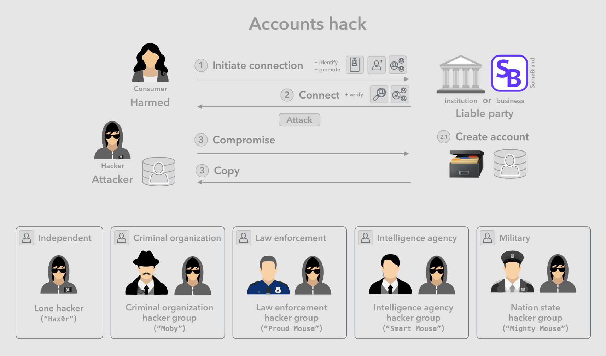

# ☠ Harm cases

Aka. attack vectors or vulnerabilities, describing the set of scenarios that lead to significantly undesirable outcomes. These can occur as the result of a malicious attack, or due to oversight or accidents.

> Note: The default technology wave we are focusing on is Web 2.0, which represents the set of modern technologies currently used on the internet and web.

The below sections first outline general themes of the harms enabled by the technology wave, and subsequently enumerate individual harm cases, first organized by the party that is harmed, then by the type of attack, vulnerability or disaster that initiates the harm.

## 👩🏻 Consumer

Below we look at significant cases where the consumer as identity owner is harmed by an attack, a security vulnerability, and/or accidental negative outcomes.

### 🗃 Hacked accounts

Businesses transacting with individuals (and institutions interacting with individual members) often keep a copy of their client's identity and personal information, in case of having to refer back to them on subsequent interactions.

1. Consumer connects and registers with business or institution
2. Business or institutions creates and account with identity and personal information
3. An attacker compromises client accounts en-masse and obtains copies
4. Attacker can further abuse identity and personal information - selling, further attacking, etc

Harm:

* Privacy rights for affected consumers have been violated.
* Can lead to subsequent harms as compromised data can be used for further attacks, or can lead to virtual or physical harmful targeting of individuals.
* Scale of the problem is very large when this a large database of accounts are compromised. Many examples have occurred recently.

Mitigation types:

1. Offline storage of account information
2. No storage of account information
3. Storage per consumer permissions
4. Privacy by design
5. Combination of some or all of above

Mitigation steps:

1. Notifying those affected of the compromise.

### 📲 Hacked devices (OS & apps)

Consumer devices hold most if not all of a person's data as well as provide access to most of the services they use. Getting root access to a device is fairly valuable to hackers, as it grants them a number of possible opportunities to take advantage of the owner's data or resources.

There are a few variations of this type of access, that could either provide more limited access, or can provide the opportunity for a subsequent elevation of privileges on the device. These include compromising the following subsystems:

* **Networking stack** through WiFi, Bluetooth, or other type of radio connection.
* **Web browser** through a compromised site.
* **App**, through a compromised app store.
* **Operating system**, through the publisher or an extension.

Harm:

* User's control over resources and actions is stolen and can lead to other harms such as loss of property
* User's privacy (sensitive data such as ones contained in email and other apps) is seriously compromised and can lead to other harms such as loss of reputation
* Access to the user's device can be hidden, waiting for an opportune moment, and preventing the user from defending themselves.
* Control of devices can be further abused to spy on the owners voice, video, physical location

Incomplete

### 🕵️ Person lookup

Looking up personal information by name, information such as address, phone number, age, and driving history. In recent years a number of paid services have started offering this ability with limited ability for individuals to opt out temporarily.

Harm:

* Direct loss of privacy as anyone can obtain information such as age, contacts and history.
* Chance of physical harm, since anyone can track and find a person's physical location.

Incomplete ...

### 🤔 Forgotten password

Forgotten user name, password, or other credentials.

Harms:

* Inconvenience, loss of time, and other resources during the recovery process
* Scale of the problem is very large since literally everyone has a large number of accounts vulnerable to this issue

Incomplete ...

### 😧 Lost credentials

Physical loss or theft of devices, or other containers of credentials.

Harms:

* Inconvenience, loss of time, and other resources during the recovery process.
* Though scattered, scale of the problem is very large since everyone independently has a large number of accounts vulnerable to this issue.
* Certainty or chance of misuse and fraud, in case of theft.
* Psychological pain of certain or suspected theft.

### 👁 Surveillance advertising

Harms:

* Loss of privacy to large and powerful service providers and advertisers.
* Sense of dis-empowerment in terms of reacting to and preventing said violation.
* Being consciously or unconsciously influenced by advertising yielded from extracted and sold insights.

Incomplete ...

### ⛓ Customer lock-in

Harm:

* Customers lose choice in the market and may feel stuck with their subpar service.
* New entrants lose access to locked in customers, even if their service is superior.
* Prices are likely to eventually become uncompetitive.
* Innovation may slow down as a result of a slowing market.

Followed by inter-related set of problems:

* Rent-seeking - Abuse of power
* Unfair barriers for new entrants
* Stifling innovation
* Uncompetitive markets

Incomplete ...

## 🧑‍💼 Business (as relying party)

Below we look at significant cases involving harm to businesses and other organizations as a so called relaying parties (entities relying on the correctness of a verification by a trusted party through credentials or other means).

### 🥸 Digital impersonation

Impersonating another person digitally and performing actions on their behalf, such as making a fraudulent payment using their payment account, or performing a high value action on their behalf (such as posting on social media, sending an email) that puts the relying party at risk of loss or other harm.

Harm:

* Merchants or payment providers may become liable for costs of fraud.
* Cost of fraud protection systems to merchants or payment providers.
* Sometimes there is additional cost to customers to prove their identity and claims.

Incomplete ...

### 🤥 Deception

Providing false information about one's identity, profile information, offered products, services, etc.

Harm:

* Merchants or platform providers may be liable for false information.
* Cost of verification systems to reduce liability risks.
* Sometimes there is additional cost to customer, for verifying their claims.

Incomplete ...

### 💸 Defaulting

When consumers take on a loan either directly or through a large purchase, the merchant and/or payment provider take on liability on the risk of default by the consumer. It is in their interest to reduce that liability risk by verifying the customer's ability and likelihood to pay back the loan. Having leverage over the customer's creditworthiness reputation also helps the likelihood of payback.

Harm:

* Loan provider, payment provider or merchant may be liable for an account's negative balance.
* Cost of credit verification system to reduce default and liability risk.
* Sometimes there is additional cost to customer, for verifying their claims.

Incomplete ...

### ⭐️ Sybil review

Customers of businesses and products increasingly rely on online reviews everyday to guide their purchasing decisions. As such, businesses find influencing these reviews more and more lucrative, and in many cases they cannot resist, and pay external actors to boost their reviews. This is a type of [sybil attack](https://en.wikipedia.org/wiki/Sybil\_attack).

Harm:

* Consumer's purchase decisions are made based on inaccurate information.
* Honest businesses with high quality products or services are harmed by losing revenue and market share.
* Consumers lose trust in the use of reviews as a reliable decision making tool.

Incomplete ...

### 💬 Sybil influence

Simulating a large number of humans on social media supporting and spreading a specific point of view, with the goal of moving the public consensus. This is a type of [sybil attack](https://en.wikipedia.org/wiki/Sybil\_attack)

Healthy public debates rely on the honesty and sincerity or the various voices expressing society's various significant points of view. In today's competitive and sometimes even polarized public conversations, many sides resort to all kinds of tactics to have their side win by bringing more of the public to their side. The social influence of some foreign governments has even been documented recently, likely with a goal of muddying the waters and decreasing an adversary's social cohesion.

Harm:

* Some social beliefs are affected by inaccurate information.
* Honest social movements with good ideas and policies are harmed by losing mind share.
* Citizens and consumers lose trust in the use of social media as a reliable learning tool.

Incomplete ...
