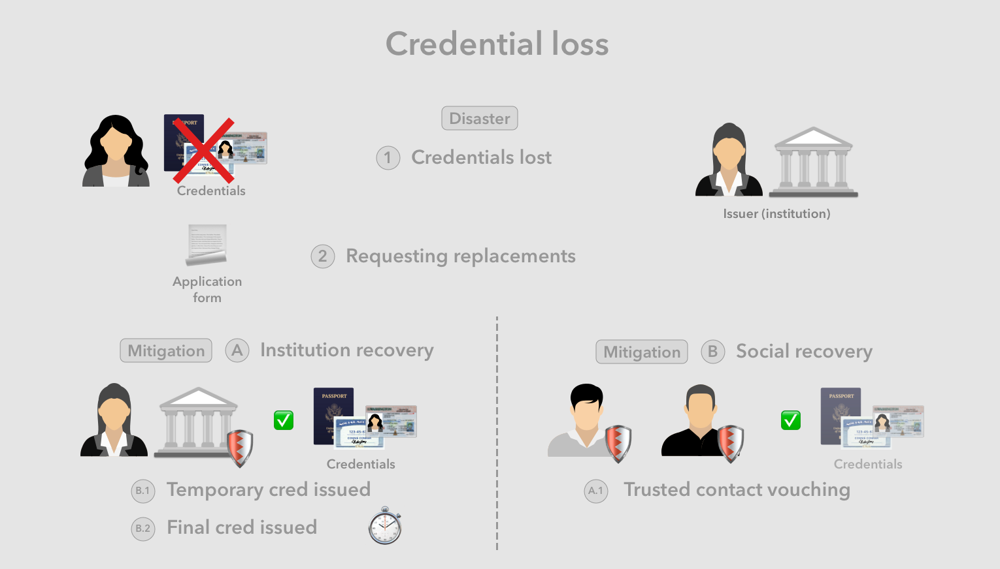

# Harm cases

Aka. attack vectors or vulnerabilities, this describes the set of scenarios that lead to significantly undesirable outcomes. These can occur as the result of a malicious attack, or due to oversight or accidents.

> Note: This section tends to the commonly expected harms unique to the Legacy+, which represents the wave of older technologies used before advent of the internet and digital information technology.

The below sections first outline general themes of the harms enabled by the technology wave, and subsequently enumerate individual harm cases, first organized by the party that is harmed, then by the type of attack, vulnerability or disaster that initiates the harm.

## 💣 Harm themes

* **Document forgery**
* **Document loss or theft**

## 👩🏻 Consumer

Below we look at significant cases where the consumer as identity owner is harmed due to an attack, a security vulnerability, and/or accidental negative outcomes.

### 🥸 Credential forgery

### 😧 Credential loss

There is only a single valid original copy of a credential, making it vulnerable to the loss or damage to the point of unusability.

1. User loses the credential or the credential is damaged beyond use
2. User may have also lost other supporting credentials
3. User needs to get a replacement credential

Mitigation types:

1. Issuer recovery
2. Social recovery
3. Combination of some or all of above

Mitigation steps:

1. Applying for a replacement credential from institution

