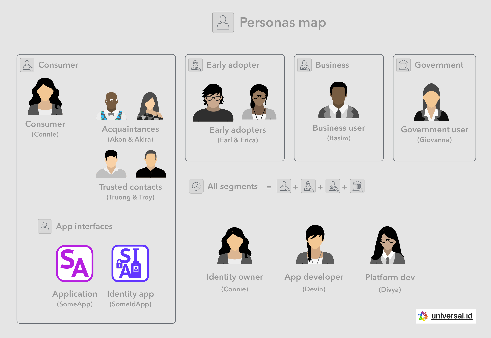
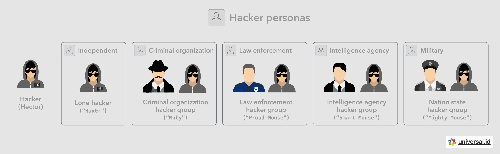

# 👤 Personas

Personas are descriptive tools used by designers, product managers and developers to scope out the important properties and aspects of users that will affect decisions made during implementation. The point of personas is to put together similar groups of users based on their significant commonalities.

We can first consider a catch-all user persona with minimum knowledge and technical ability. To further specialize in the identity space, as with many other industries, the use cases and user personas can first be divided into groups corresponding to market segments such as consumer, business, and government. The common users in each of these segments do have differentiated aspects around their motivations, wants, needs and levels of technical sophistication.

Developer personas for platform and application development can also be considered across all segments to start.

## 👩 Consumer - Connie

Connie is the consumer end user, one of the main persons we all ultimately serve as decentralized identity ecosystem stakeholders. She is part of the early majority of technology adopters, but not part of the early adopter crypto or general tech communities. She is likely in the age range 20-40, likely with undergraduate education. She is comfortable using consumer technology such as a selection of the following: smart phone (iPhone or Android), the web (Chrome, Safari), search (Google), email (GMail, Outlook), social networking and messaging (Instagram, Facebook, Twitter, WhatsApp, Skype, iMessage, FaceTime), and other consumer services (AirBnB, Google Maps, Spotify, Uber, Amazon, Office). She has a non-technology day job, likely a family and kids, and little time to tinker with technology. She wants things to just work, the way her iPhone and apps just work for the most part.

### ✅ Trusted contact - Truong & Troy

 

Troy and Truong are Connie's more trusted contacts, ones that may be entrusted with guardianship responsibilities for the purpose of monitoring, approval, recovery and/or estate planning. For example Troy can be Connie's brother or father, a responsible family member she trusts more, and Truong could be Connie's romantic or life partner.

### 👋 Acquaintance - Akon & Akira

 

Akon and Akira are two of Connie's extended group of social acquaintances, with varying levels of closeness.

## 🤓 Early adopter - Earl & Erica

 

Earl and Erica are the tech enthusiast (technophiles) and early adopter end users, one of the main group of people we all ultimately serve as decentralized identity ecosystem stakeholders. Their abilities and demands are a superset of Connie's (the consumer end user). They are early adopters of crypto and/or other new technologies, as well as members of tech communities. They are likely in the age range 15-40, with technical education and/or coding experience. They likely have technology-related day jobs, and plenty of time to tinker with technology. They are comfortable using consumer technology but want deeper involvement, they want to understand how things work, and be able to customize the functions of their digital gadgets and apps.

## 🧑‍💻 App developer - Devin

Devin is the development-operations person working on decentralized-identity-enabled consumer apps. She spends most of her day focusing on the aspects of their app services and infrastructure that are key to their app's main business. She needs to ensure that the app interfaces like their web portal and smart phone apps (iPhone and Android) just work for their customer Connie, who also happens to be our customer. When beginning to look at a new identity subsystem, she has limited time to dedicate to fully understanding, integrating and operating identity infrastructure for WhatsApp's services. However she does also demand a certain degree of control and customizability to their identity infrastructure, given Devin's full control over other parts of their service. As time passes, Devin will demand more and more from the identity subsystem, and may even demand to fork off the code, customize, maintain and operate it herself.

## 🧑‍💻 Core developer - Divya

Divya is an identity core platform, app or infrastructure development-operations person, which means she is a major stakeholder on the decentralized identity ecosystem. She spends most of her day focusing on the aspects of services and infrastructure that are key to decentralized identity ecosystem operations. She needs to ensure that infrastructure pieces function and are easy to use for app developers such as Devin. She also needs to provide support to Devin and app developers in general, with any issues.

## 📲 Apps and services

In addition to persona's this document highlights typical and representative examples of apps and backing web services that each persona could interact with in some way.

Additionally consumers will typically interact with a large number of vertical apps and businesses that will rely on the greater decentralized identity system comprising of connected, public and private identity subsystems.

### 🆔 Identity app

 

SomeIdentityApp is a secured identity app that consumers interact with directly on their devices.

### ⏹ Vertical app

 

 

SomeApp is a well known commercial web service and app that consumer interact with directly on their devices. It is representative of any vertical app in any given commercial vertical business area, such as direct retail, hospitality, technology applications, communications, etc.

 

SomeBrand is a public facing brand that consumer interact with directly. It is representative of any commercial vertical business, in an area such as retail, hospitality, technology, communications, energy, real estate etc. It is differentiate from SomeApp in that it does not necessarily offer a consumer app.

## 👨‍💻 Hacker - Hector

Hector is the hacker persona, who has the technical ability to discover and/or exploit system vulnerabilities and the desire to do so for personal or group gain, despite ethical and legal impediments, and despite security measures taken to make his efforts difficult.

There are at least 5 major categories of stakeholders funding hacking operations:

### 👨‍💻 Lone hacker

Any one person from anywhere in the world with access to the internet, advanced security technology chops, and little other resources, can take a shot at compromising valuable systems and resources for monetary gain.

### 🔫 Criminal organization

Where cyber attacks require additional resources and investment, hackers act as part of larger criminal organization to carry out cyber operations for monetary gain of the organization.

### 🕵️‍♀️ Intelligence agency

Intelligence agencies are always looking for more valuable information, especially related to foreign adversaries. As such, cyber operations have become one of the most cost effective methods of gathering intelligence.

### 🎖 Military

Military forces are most concerned with defending nations, although they do sometimes engage in asymmetric offensive and destructive operations. One of the most cost effect of these methods has become using cyber operations.

### 👮 Law enforcement

Law enforcement agencies may compromise systems and manipulate them as part of investigations into crimes, most often of the cyber nature, to investigate or recover lost resources.
