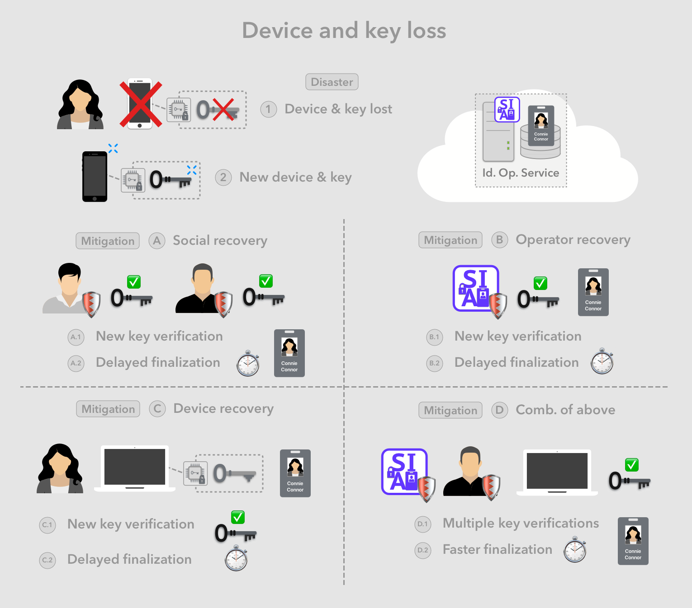
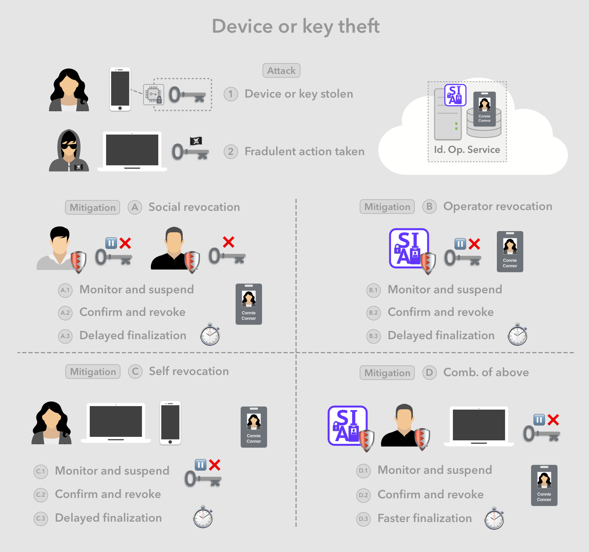

# Harm cases

Aka. attack vectors or vulnerabilities, this describes the set of scenarios that lead to significantly undesirable outcomes. These can occur as the result of a malicious attack, or due to oversight or accidents.

> Note: This section tends to the commonly expected harms unique to the Web 3.0, which represents the wave of a set of upcoming technologies to be used on the internet in the coming decade or so.

The below sections first outline general themes of the harms enabled by the technology wave, and subsequently enumerate individual harm cases, first organized by the party that is harmed, then by the type of attack, vulnerability or disaster that initiates the harm.

## 💣 Harm themes

* **Key management**
* **Privacy loss on public blockchains** - through easier correlation and public usage information

## 🧑 Identity owner

Below we look at significant cases where the identity owner is harmed due to an attack, a security vulnerability, and/or accidental negative outcomes.

### 😧 Device/key loss

Only a single copy of every given private keys is stored in a given device, making it vulnerable to the loss of that key due to device malfunction or loss.

1. User loses the device or the device is damaged beyond repair
2. User purchases a new device, install an identity app, and creates a new key
3. USer needs to be able to connect the new identity app and key to their existing identity

Mitigation types:

1. Identity operator recovery
2. Social recovery - Designated guardians agreeing to verify a new device and key
3. Alternative device recovery
4. Combination of some or all of above

Mitigation steps:

1. New key is verified
2. Key verification is finalized with delay

### 😱 Device/key theft

Only a single copy of every given private keys is stored in a given device, however there is a chance that the device can be physically stolen and the private key fraudulently used. Also there is a much smaller chance that a hacker can steal the private key likely by having access to the physically stolen device.

1. User device is physically stolen, and/or hacker gets access to private key.
2. Hacker performs fraudulent activity using the stolen key

Mitigation:

1. High value level activities will be delayed by design, increasing the chance fraudulent activities can be detected and suspended before finalization.

Mitigation types:

1. Identity operator revocation
2. Social revocation - Designated guardians monitoring and suspending a key, then agreeing to revoke it.
3. Alternative device revocation
4. Combination of some or all of above

Mitigation steps:

1. Suspends after monitoring, and detecting a suspicious fraudulent activity
2. Revoke key after confirming activity is indeed fraudulent
3. Key revocation is finalized with delay

